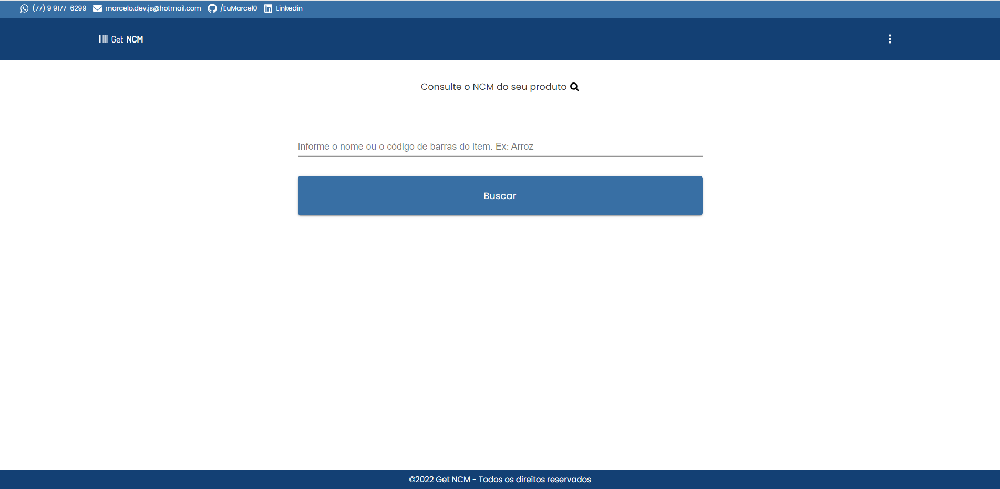
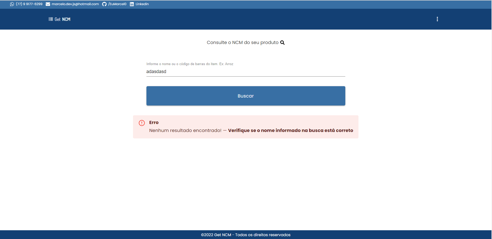
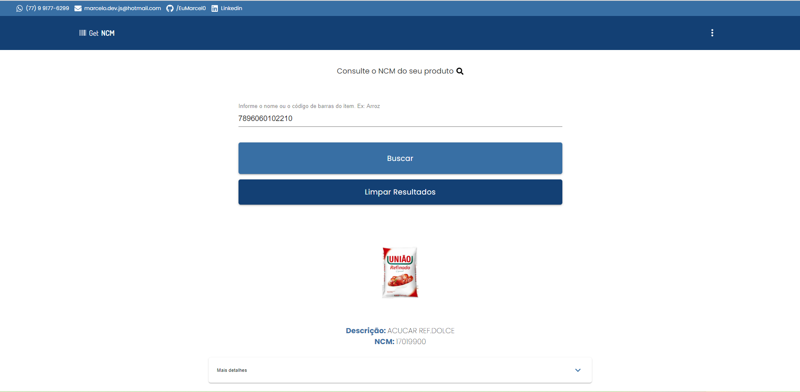

# Catálogo NCM de mercadorias

🚧Deploying...🚧

Esta aplicação foi desenvolvida para buscar NCMs de mercadorias e mostrar em tela para o usuário. Ela está consumindo uma API do [COSMOS](https://cosmos.bluesoft.com.br/api) e tem um limite máximo de consultas por dia. 
Todo o design do projeto foi pensado e desenvolvido por mim, buscando sempre trazer uma aplicação leve e visualmente intuitiva.

## 🚀 Começando

Para acessar o projeto basta clicar aqui: "Deploying..."

### 🎥 Usabilidade e funcionalidades

Para utilizar, basta informar o nome de alguma mercadoria ou o código de barras e clicar em "Buscar" ou teclar "Enter".

## 🛠️ Construído com

Todo o projeto foi construído utilizando:

* [React](https://pt-br.reactjs.org/docs/getting-started.html)
* [TypeScript](https://www.typescriptlang.org/docs/)
* [Material UI](https://v4.mui.com/)
* [Font Awesome](https://fontawesome.com/icons)
* [CSS Module](https://github.com/css-modules/css-modules)
* [API](https://cosmos.bluesoft.com.br/api)

## 📌 Versão

Todo controle de versão foi realizado dentro do repositório do GitHub.

## ✒️ Autores

* **Marcelo Silva** - *Todo front-end da aplicação* - [/EuMarcel0](https://github.com/EuMarcel0)

## 📄 Licença

open source.

## 🎁 Expressões de gratidão

Fico muito grato por ter concluído este projeto, pois foi o primeiro trabalho pessoal utilizando React. No inicio apareceram vários probleminhas que achei que não fosse conseguir resolver, mas no final, depois de muito estudo e consultas, deu tudo certo, graças à Deus.
💻🚀😊😊
